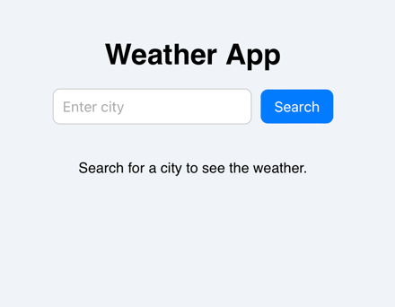
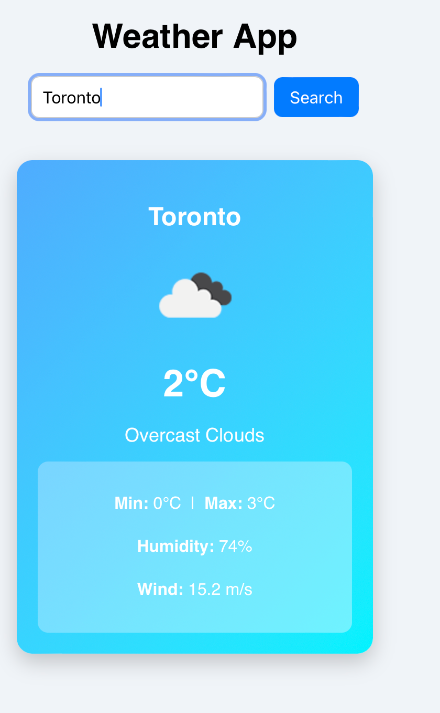
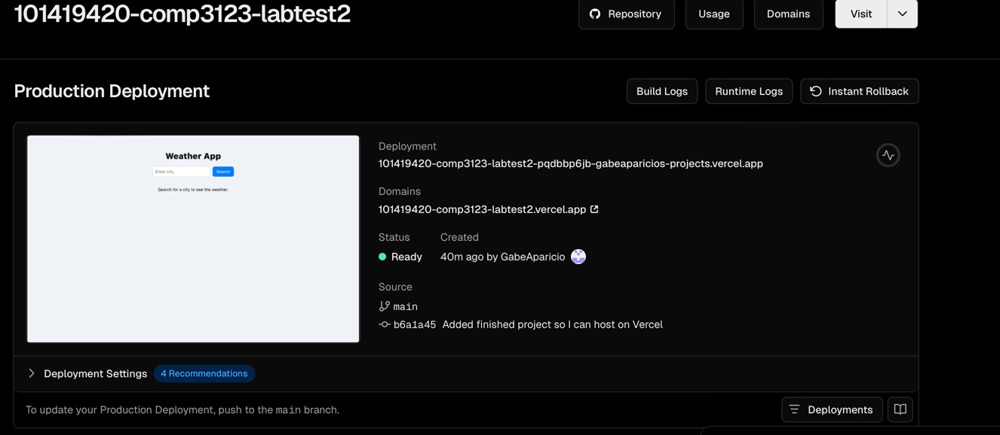
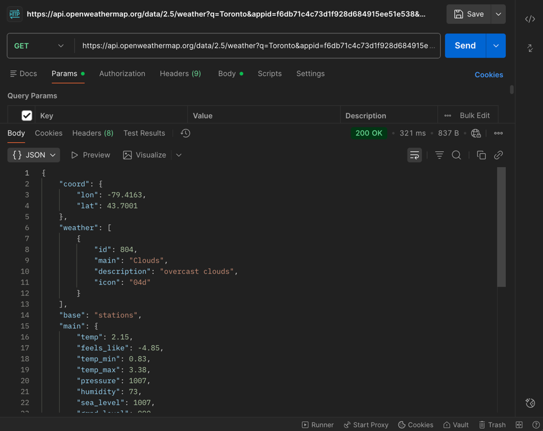

# Weather App – COMP3123 Lab Test 2

This is a simple React weather application built for **COMP3123 Full Stack Development I (Lab Test 2)**.  
The app allows users to search for any city and view real-time weather information.

---

##  Project Description

The application uses React function components, state, props, and hooks to fetch weather data from the **OpenWeatherMap Current Weather API**.

Displayed information includes:
- Temperature (°C)
- Weather description
- Weather icon
- Min & max temperature
- Humidity
- Wind speed

The app is styled with basic inline CSS and deployed on Vercel.

---

##  Live Demo

https://101419420-comp3123-labtest2.vercel.app

---

##  API Used

**OpenWeatherMap – Current Weather Endpoint**  
https://api.openweathermap.org/data/2.5/weather

Request format:
https://api.openweathermap.org/data/2.5/weather?q={city}&appid={API_KEY}&units=metric

---

##  Setup Steps

### 1. Install dependencies
npm install

### 2. Run the app
npm start

### 3. Build for production
npm run build

---

##  Screenshots

---

##  Notes / Assumptions

- Uses metric units (°C) for all temperature values.
- City names must be typed correctly for valid results.
- Only the current weather endpoint was used (no forecast).
- API key must be active for real data to load.
